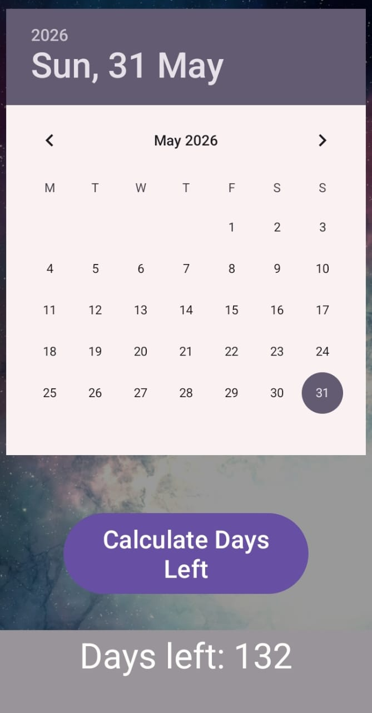

<h1 align="center">📅 Days_calc</h1>

  

  
  
  

<h2>📖 About the App</h2>

<b>Days_calc</b> is a lightweight and easy-to-use Android application that helps users
calculate how many days are left or passed from today to a particular date.

Instead of manually counting dates on a calendar, this app gives instant results
with just a few taps, making it a simple yet effective time-saving tool.

<h2>⚙️ How the App Works</h2>

<ol>
  <li>User opens the app.</li>
  <li>Selects a specific date using the date picker.</li>
  <li>The app compares the selected date with today’s date.</li>
  <li>Total number of days is calculated automatically.</li>
  <li>The result is displayed clearly on the screen.</li>
</ol>

<h2>✨ Key Features</h2>

<ul>
  <li>Clean and minimal user interface</li>
  <li>Easy date selection</li>
  <li>Instant and accurate calculation</li>
  <li>Helps save time and effort</li>
</ul>

<h2>🖼️ App Preview</h2>

  
  

  <i>(Add your app screenshots inside a <b>screenshots</b> folder)</i>

<h2>🛠️ Tech Stack</h2>

  
  
  

<h2>🚀 How to Run the Project</h2>

<pre>
git clone https://github.com/yourusername/Days_calc.git
</pre>

<ol>
  <li>Open the project in <b>Android Studio</b></li>
  <li>Allow Gradle to sync</li>
  <li>Run the app on an emulator or Android device</li>
</ol>

<h2>🎯 Purpose</h2>

This app was built as a simple utility project to practice Android development
and to create a small tool that can be genuinely useful in daily life.

<h2>👨‍💻 Author</h2>

<b>Shreyas</b> 
Computer Science Student 
GitHub: <a href="https://github.com/shrey-space">shrey-space</a>

  <i>Simple idea. Instant results. Saved time.</i>

